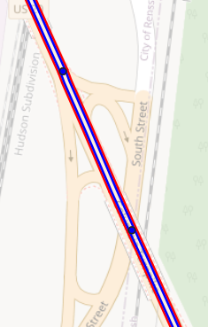
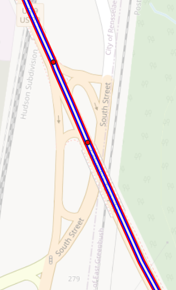
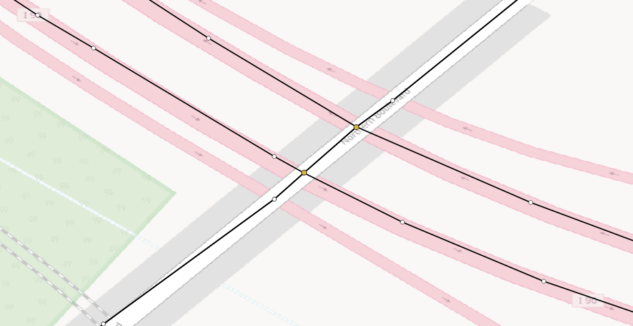
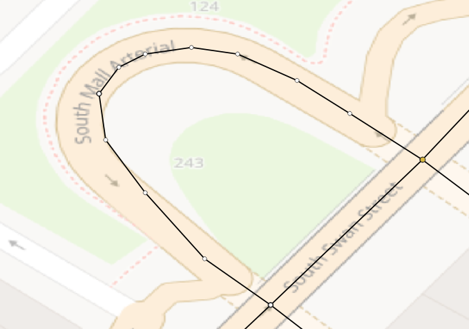
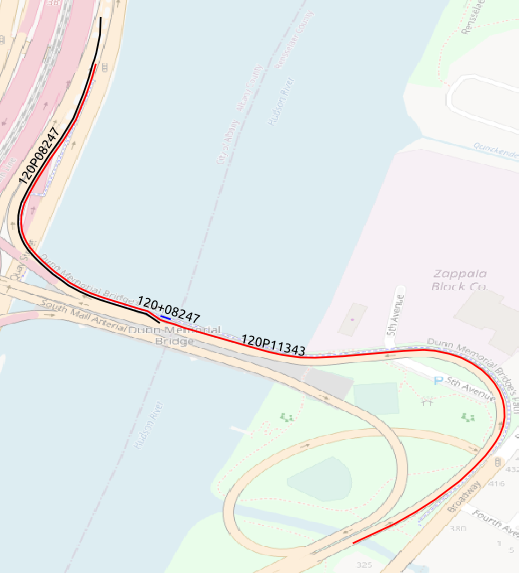
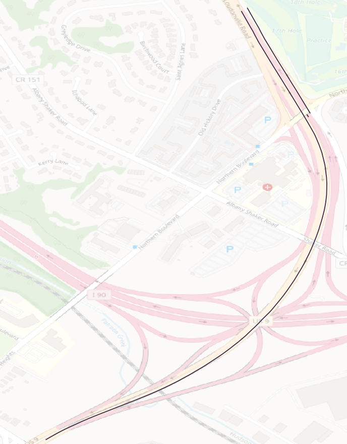

# Investigations

NOTE: Used the TMC GeoJSON Features collected from the RITIS MassiveDataDownloader.

## Do all TMCs have a linear_id?

ANSWER: Yes.


```sql
prometheus=# select count(1) from tmc_shapes_2017 where linear_id is null;
 count 
-------
     0
(1 row)

prometheus=# select count(1) from tmc_shapes_2018 where linear_id is null;
 count 
-------
     0
(1 row)

prometheus=# select count(1) from tmc_shapes_2019 where linear_id is null;
 count 
-------
     0
(1 row)

prometheus=# select count(1) from tmc_shapes_2020 where linear_id is null;
 count 
-------
     0
(1 row)

prometheus=# select count(1) from tmc_shapes_2021 where linear_id is null;
 count 
-------
     0
(1 row)

prometheus=# select count(1) from tmc_shapes_2022 where linear_id is null;
 count 
-------
     0
(1 row)
```

## Do all TMCs have a direction?

ANSWER: Yes.

```sql
prometheus=# select count(1) from tmc_shapes_2017 where direction is null;
 count 
-------
     0
(1 row)

prometheus=# select count(1) from tmc_shapes_2018 where direction is null;
 count 
-------
     0
(1 row)

prometheus=# select count(1) from tmc_shapes_2019 where direction is null;
 count 
-------
     0
(1 row)

prometheus=# select count(1) from tmc_shapes_2020 where direction is null;
 count 
-------
     0
(1 row)

prometheus=# select count(1) from tmc_shapes_2021 where direction is null;
 count 
-------
     0
(1 row)

prometheus=# select count(1) from tmc_shapes_2022 where direction is null;
 count 
-------
     0
(1 row)
```

## linear_id and direction

### Do linear_ids have a consistent direction within a county?

ANSWER: No.

```sql
select county, linear_id, count(distinct direction)
  from tmc_shapes_2022
  group by 1,2
  having count(distinct direction) > 2
  order by 3 desc, 1,2;

   county    | linear_id | count 
-------------+-----------+-------
 ERIE        |       259 |     4
 GREENE      |       205 |     4
 HERKIMER    |        61 |     4
 ONEIDA      |       114 |     4
 QUEENS      |        48 |     4
 QUEENS      |       127 |     4
 SUFFOLK     |       203 |     4
 WESTCHESTER |       116 |     4
 QUEENS      |        99 |     3
(9 rows)
```

## linear_id and road_order

Looks like road_order is contiguous across the linear_id.
We can use it to create Network Paths.
We must break the path when the direction reverses back on itself.

NOTE: road_order values repeat. Case: linear_id 48 for 2022.
Cannot be used alone to generate TMC Paths--must combine with start/end coords.

## Overlapping TmcLinears

The TmcLinears for US-9 and US-20 overlap through Rensselaer County

The current intersections algorithm shows 8 intersections because
where start/end points overlap there are U-Turns where TmcLinear changes.

NOTE: Not all TMCs for the overlapping TmcLinears are identical.

|  |
|:--:|
| *US-9 endpoints in Rensselaer, NY* |

|  |
|:--:|
| *US-20 endpoints in Rensselaer, NY* |

*NOTE: US-9 linear_id = 44 and US-20 linear_id = 49.*

```sql
npmrds_production=# select linear_id, isprimary, count(1) from ny.tmc_identification_2022 as a inner join ny.mdd_tmc_shapes_2022 as b using (tmc) where linear_id in (44, 49) and b.county = 'RENSSELAER' group by 1,2 order by 1,2;
 linear_id | isprimary | count 
-----------+-----------+-------
        44 |         0 |     4
        44 |         1 |    21
        44 |           |     5
        49 |         0 |    10
        49 |         1 |    32
(5 rows)
```

## TmcLinear Paths

### Why so many sources?

NOTE: linear_id 33 is I-81

```sql
prometheus=# select linear_id, direction, max(source_rank), count(distinct tmc) from npmrds_tmc_shapes_analysis.tmc_linear_paths_2022 where linear_id = 33 group by 1,2 order by 3 desc, 2, 1;
 linear_id | direction  | max | count 
-----------+------------+-----+-------
        33 | NORTHBOUND |  41 |   151
        33 | SOUTHBOUND |  31 |   151
(2 rows)
```

```sql
prometheus=# select tmc, start_longitude, end_longitude, start_latitude, end_latitude
prometheus-# from npmrds_tmc_shapes_analysis.tmc_shapes_2022
prometheus-# where tmc in ('104P04979', '104+04980') ;
    tmc    | start_longitude | end_longitude | start_latitude |  end_latitude   
-----------+-----------------+---------------+----------------+-----------------
 104+04980 |        -75.7939 |       -75.814 |       42.04517 |        42.09584
 104P04979 |        -75.7912 |      -75.7939 |       42.04051 | 42.045169987156
(2 rows)
```

Need to round the start/end lat/lngs while creating the network nodes table.

SEE: [table of what each digit in a decimal degree signifies](https://gis.stackexchange.com/a/8674)

> The sixth decimal place is worth up to 0.11 m: you can use this for laying
> out structures in detail, for designing landscapes, building roads. It should
> be more than good enough for tracking movements of glaciers and rivers. This
> can be achieved by taking painstaking measures with GPS, such as
> differentially corrected GPS.

TmcLinearPath for linear_id=33 (I-81) after rounding start/end coords to 6 decimal places.

```sql
prometheus=# select linear_id, direction, max(source_rank), count(distinct tmc) from npmrds_tmc_shapes_analysis.tmc_linear_paths_2022 where linear_id = 33 group by 1,2 order by 3 desc, 2, 1;
 linear_id | direction  | max | count 
-----------+------------+-----+-------
        33 | NORTHBOUND |   1 |   151
        33 | SOUTHBOUND |   1 |   151
(2 rows)
```

## TMC MultiLinestrings and bearing at intersections


```sql
prometheus=# select public.ST_NumGeometries(wkb_geometry), count(1) from npmrds_tmc_shapes_analysis.tmc_shapes_2022 group by 1 order by 2 desc limit 10;
 st_numgeometries | count 
------------------+-------
                1 | 50787
                2 |    15
(2 rows)
```

SEE:

* [ST_NumGeometries](https://postgis.net/docs/ST_NumGeometries.html)
* [ST_Dump](https://postgis.net/docs/ST_Dump.html)
* [ST_LineSubstring](https://postgis.net/docs/ST_LineSubstring.html)
* [ST_GeometryN](https://postgis.net/docs/ST_GeometryN.html)
* [ST_PointN](https://postgis.net/docs/ST_PointN.html)

* [SharedStreets References](https://github.com/sharedstreets/sharedstreets-ref-system/blob/master/README.md#sharedstreets-references)

I seem to recall that the start/end lon/lats are based on the 1st geometry of the MultiLineString.
TODO: Test that.

NOTE: Based on a visual inspection, ALL the multi-geometry TMCs for 2022 are
self-intersecting loops. I did not see any of the forked TMCs that were in
earlier map versions. However, for 2017 there are multi-geometry TMCs that are
not self-intersecting loops. (In the conflation project there is code to merge
these multi-geometry shapes into a single line.)

## Short TMCs

```sql
prometheus=# select public.st_length(public.geography(public.st_geometryn(wkb_geometry,1))) from npmrds_tmc_shapes_analysis.tmc_shapes_2022 where public.st_numgeometries(wkb_geometry) = 1 order by 1 limit 10;
    st_length     
------------------
 3.33278825590942
 3.33278825590942
 3.43118193982199
 4.02832384950184
 4.02832384950184
 4.44205769838689
 4.44205769838689
 4.52142550615445
 4.75271645026133
 4.76877249375311
(10 rows)
```

TODO: Add start/end bearings to tmc_network_edges_:YEAR.

## TmcLinear Crossings

TMCs share coordinates not only at Intersections, but also Crossings.

|  |
|:--:|
| *I-90 and Northern Blvd in Albany, NY* |
| *The Northern Blvd overpass shares coordinates with I-90.* |
| *(Red cicles indicate Points shared by TMCs.)* |

It seems as though INRIX is **sometimes** intentionally creating points where TmcLinears cross each other,
even if those crossings are not intersections.

|  |
|:--:|
| *I-90 and I-787 Interchange in Albany, NY.* |
| *It seems as though INRIX is intentionally creating sharing points between TMCs.* |
| *(Red cicles indicate Points shared by TMCs.)* |

|  |
|:--:|
| *South Swan Street and South Mall Arterial in Albany, NY.* |
| *It seems as though INRIX is NOT intentionally creating sharing points between TMCs.* |
| *(Red cicles indicate Points shared by TMCs.)* |

CONSIDER: Should we add Crossings using PostGIS where there are no shared
          coordinates? Could create synthetic nodes for the purpose of
          high level network grid creation.

          Difficulty would be TMC Edge path_idx and distance along.

## TMC Internal/External Sections

When old TMCs are truncated near intersections and new TMCs added, are the new TMCs "internal" TMCs?

## TMC Types

[TMC/Location Code List/Location Types](https://wiki.openstreetmap.org/wiki/TMC/Location_Code_List/Location_Types)

> Every TMC location is characterized by a class (letter P, L, A for point,
> line, area), type (first number) and subtype (second number).

```sql
npmrds_production=# select type, count(1) from ny.tmc_identification_2022 group by 1 order by 2 desc;
 type  | count 
-------+-------
 P1.11 | 41920
 P1.3  |  4533
 P4.0  |  2673
 P3.14 |   576
 P1.1  |   339
 P3.2  |   200
 P1.13 |   162
 P1.8  |   151
 P3.16 |    82
 P3.3  |    48
 P3.1  |    33
 P3.37 |    23
 P3.18 |    12
 P3.4  |    12
 P1.7  |    12
 P1.6  |    12
 P3.17 |     6
 P3.27 |     6
 P1.10 |     2
(19 rows)
```

```
* P1.11   cross-roads
* P1.3    motorway junction
* P4.0    link road point
* P3.14   border/frontier
* P1.1    motorway intersection
* P3.2    bridge
* P1.13   intermediate node
* P1.8    roundabout
* P3.16   toll plaza
* P3.3    service area
* P3.1    tunnel
* P3.37   place name
* P3.18   harbour
* P3.4    rest area
* P1.7    underpass
* P1.6    flyover
* P3.17   ferry terminal
* P3.27   airport
* P1.10   traffic lights
```

## OVERLAPS

Cases where more than two TMC Linears overlap?

Need to filter overlaps out from the Matched Crossings.

## RESOURCES

* [TISA Guidelines for TMC conflation](https://tisa.org/wp-content/uploads/SP17005_TISA-Guidelines-for-TMC-conflation.pdf)
* [HERE How TMC Works](https://developer.here.com/documentation/location-library/dev_guide/docs/location-referencing-tmc.html#how-tmc-works)
* [RITIS NPMRDS Documentation](https://npmrds.ritis.org/static/help/docs/NPMRDS.pdf)
* [INRIX Segments](https://docs.inrix.com/reference/getsegments/)
* [Wikipedia Traffic message channel](https://en.wikipedia.org/wiki/Traffic_message_channel)

### Medium Article Series:

* [Location Referencing: How to properly provide geospatial data](https://medium.com/swlh/location-referencing-422dfeb82b42)

* [Location Referencing: TMC, Alert-C The case of pre-coded locations and the need of radio broadcasting traffic information](https://medium.com/swlh/location-referencing-tmc-alert-c-6490c25dfd7)

> Within RDS-TMC, locations are identified and referenced by their location
> code. Keep in mind that a real world location may have more than one location
> code, but on the contrary one location code identifies univocally one and
> only one real world location.

> Each record of the location tables has the same nominal content as for the following list:
>
> * Location code
> * Code of location (sub) type
> * Road/junction number
> * Road name
> * First name
> * Second name
> * Area reference
> * Linear reference
> * Negative offset
> * Positive offset
> * Urban
> * Intersection reference
> * WGS 84 coordinates

### Academic Papers

Very thorough:

* [Methods-and-Implementations-of-Road-Network-Zhang](https://mediatum.ub.tum.de/doc/820125/document.pdf)
  * [(references)](https://www.semanticscholar.org/paper/Methods-and-Implementations-of-Road-Network-Zhang/4be4c3d8d9d611d16d506b41be43af3fe3ce1c37#cited-papers)

Promising title:

* [Automatic relocation of link related data in an updated road map](https://elib.dlr.de/113906/4/INTSYS2017_DLR.pdf)

* [A topological algorithm for determining how road networks evolve over time](https://dl.acm.org/doi/10.1145/2996913.2996976)
  * [pdf](https://dl.acm.org/doi/pdf/10.1145/2996913.2996976)

## Self-overlapping TMC Linears

EXAMPLE: RT-9 NORTHBOUND (linear_id 44) for 2017 as it leaves the Dunn Memorial Bridge.

|  |
|:--:|
| *Overlapping TMCs for RT-9 TmcLinear.* |

```
npmrds_production=#
    select tmc, nhs, isprimary, road_order, miles
      from ny.tmc_identification_2017
      where tmc in ('120P08247', '120P11343', '120+08247', '120+08248')
      order by road_order;

    tmc    | nhs | isprimary | road_order |  miles   
-----------+-----+-----------+------------+----------
 120P11343 |  -1 |         0 |        310 | 0.599952
 120+08247 |  -1 |         0 |        311 | 0.005325
 120P08247 |   1 |         1 |        312 | 0.279698
 120+08248 |   1 |           |        313 | 0.317577
(4 rows)
```

It looks like 120P08247 exists because it begins where RT-9 and RT-20 split.
Prior to that split, RT-20's TMCs are the isprimary TMCs.
The problem is that 120P11343 extends too far.
It should stop at 120+08247.

**🔑🔑🔑 The road_orders do seem to suggest a way to do that. 🔑🔑🔑**
1120P11343 (road_order=310) should get truncated
where 120+08247 (road_order=311) starts
when computing node idx and distance along a TmcLinearPath.


A long primary TMC 120P08247 overlaps non-primary TMCs 120P11343 & 120+08247.
120P11343 is long and connects to the next TMC along the path, 120+08248.
120+08247 is very short and its endpoint connects to the start point of 120P11343.
The endpoint of 120P08247 does not connect to start points of 120P11343 or 120+08248.

A TMC Linear overlapping itself in a given direction was not expected.
These cases make detecting the overlaps of two distinct TmcLinears messy.
They also complicate calculating distance along a TMC Linear between two nodes.

It does appear as though the overlapping TMCs are comprised of common nodes where they overlap.
Node indexes along path could detect common subsequences and accomodate them.

Notice how the node_id sequences repeat along the TmcLinear path:

```
dama_dev_1=#
    select tmc, pt_geom_idx, node_id, node_idx_along_path
      from npmrds_network_paths_node_idx_2017
      where
        linear_id = 44
        and direction = 'NORTHBOUND'
        and node_idx_along_path between 630 and 645
        order by node_idx_along_path
    ;

    tmc    | pt_geom_idx | node_id | node_idx_along_path 
-----------+-------------+---------+---------------------
 120P11343 |          37 |   31040 |                 630
 120P11343 |          38 |   31020 |                 631
 120P11343 |          39 |   30983 |                 632
 120P11343 |          40 |   30966 |                 633
 120P11343 |          41 |   30915 |                 634
 120P11343 |          42 |   30896 |                 635
 120P11343 |          43 |   30858 |                 636
 120P11343 |          44 |   30822 |                 637
 120P11343 |          45 |   30815 |                 638
 120P11343 |          46 |   30787 |                 639
 120P11343 |          47 |   30749 |                 640
 120P11343 |          48 |   30730 |                 641
 120P11343 |          49 |   30700 |                 642
 120P11343 |          50 |   30671 |                 643
 120P11343 |          51 |   30657 |                 644
 120P11343 |          52 |   30645 |                 645
(16 rows)

dama_dev_1=#
    select tmc, pt_geom_idx, node_id, node_idx_along_path
      from npmrds_network_paths_node_idx_2017
      where
        linear_id = 44
        and
        direction = 'NORTHBOUND'
        and
        node_idx_along_path between 666 and 681
      order by node_idx_along_path
    ;

    tmc    | pt_geom_idx | node_id | node_idx_along_path 
-----------+-------------+---------+---------------------
 120+08247 |           1 |   31040 |                 666
 120+08247 |           2 |   31020 |                 667
 120P08247 |           1 |   31020 |                 667
 120P08247 |           2 |   30983 |                 668
 120P08247 |           3 |   30966 |                 669
 120P08247 |           4 |   30915 |                 670
 120P08247 |           5 |   30896 |                 671
 120P08247 |           6 |   30858 |                 672
 120P08247 |           7 |   30822 |                 673
 120P08247 |           8 |   30815 |                 674
 120P08247 |           9 |   30787 |                 675
 120P08247 |          10 |   30749 |                 676
 120P08247 |          11 |   30730 |                 677
 120P08247 |          12 |   30700 |                 678
 120P08247 |          13 |   30671 |                 679
 120P08247 |          14 |   30657 |                 680
 120P08247 |          15 |   30645 |                 681
(17 rows)
```

## TMCs occurring more than once along a path

```
dama_dev_1=# select * from npmrds_network_paths_2017 where tmc = '120+11269';
 linear_id | direction  | path_idx | source_rank | depth |    tmc    
-----------+------------+----------+-------------+-------+-----------
        44 | NORTHBOUND |       24 |           3 |     3 | 120+11269
        44 | NORTHBOUND |       33 |           4 |     3 | 120+11269
(2 rows)
```

REASON: Multiple sources, the TMC is reachable from each.
Example: 120+08252 is reachable from both 120P08251 and 120P08250.

|  |
|:--:|
| *Two Tmc Linear Path Sources Reaching Same Node* |

Some TMCs start at the internal node of another TMC long the Path,
such as 120+08247 and 120+08251 for TmcLinear 44 in 2017.

Others start after a gap in the road network,
such as 120+08250 and 120+11271 for TmcLinear 44 in 2017.

The logic used to create the npmrds_network_paths_:YEAR tables is flawed.
It MUST accomodate TMCs that start in the middle of another TMC along the TmcLinearPath.

## NULL road_order

For 2019 only, there are two linear_ids where ALL TMCs have NULL road_orders.

```
dama_dev_1=#
    select linear_id, count(1)
      from tmc_shapes_2019
      where road_order is null
      group by 1;

 linear_id | count 
-----------+-------
  12031623 |     6
  12031626 |    10
(2 rows)

dama_dev_1=#
    select linear_id, count(1)
      from tmc_shapes_2019
      where linear_id in ('12031623', '12031626')
      group by 1;

 linear_id | count 
-----------+-------
  12031623 |     6
  12031626 |    10
(2 rows)
```

### ISO Specifications

(NOTE: the ISO Specifications are not free.)

* [ISO 14819-1:2021 Intelligent transport systems — Traffic and travel information messages via traffic message coding — Part 1: Coding protocol for Radio Data System-Traffic Message Channel (RDS-TMC) using ALERT-C](https://www.iso.org/standard/76781.html)
* [ISO 14819-2:2021 Intelligent transport systems — Traffic and travel information messages via traffic message coding — Part 2: Event and information codes for Radio Data System-Traffic Message Channel (RDS-TMC) using ALERT-C](https://www.iso.org/standard/76782.html)
* [ISO 14819-3:2021
Intelligent transport systems — Traffic and travel information messages via traffic message coding — Part 3: Location referencing for Radio Data System-Traffic Message Channel (RDS-TMC) using ALERT-C](https://www.iso.org/standard/76783.html)


## ALERT-C

From [Geometry-Based Matching of Routes Between Dissimilar Maps](https://link.springer.com/chapter/10.1007/978-3-319-49646-7_30)

> “ALERT-C”, the official name for the TMC standard [19]

* [Use of ALERT-C location referencing system](https://docs.datex2.eu/general/DATEXII-UserGuide-UseOfALERT-C.html)

### OpenLR

* [What is OpenLR™?](https://www.openlr-association.com/method.html)
* [OpenLR™ White Paper](https://www.openlr-association.com/fileadmin/user_upload/openlr-whitepaper_v1.5.pdf)
* [tomtom-international/openlr](https://github.com/tomtom-international/openlr)
