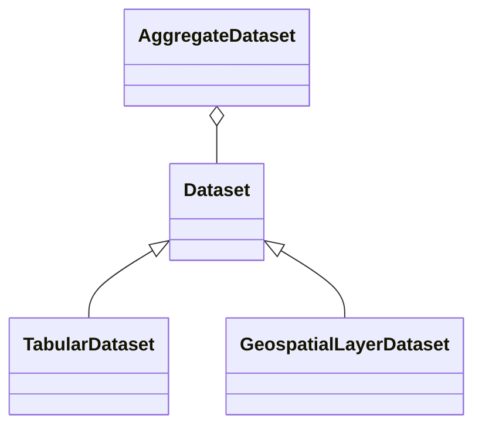

# Datasets Class Hierarchy

Should eventually fit into a class hierarchy

An AggregateDataset example would be a FileGDB with multiple layers.
One point of confusion would be distinguishing between clean layered
AggregateDatasets and synthesis datasets like transcom.transcom_events_aggregate.
In the former, we refer to UML "aggregate" relations.
In the later, we refer to DomainDrivenDesign "aggregates".

A TabularDataset example would be an uploaded CSV, or a table within the database.

A GeospatialLayerDataset would be a layer within a FileGDB, a GeoJSON file,
or a PostGIS table within the database.

It may be possible to get a single interfaces for both TabularDatasets and GeospatialLayerDatasets.
AggregateDatasets
