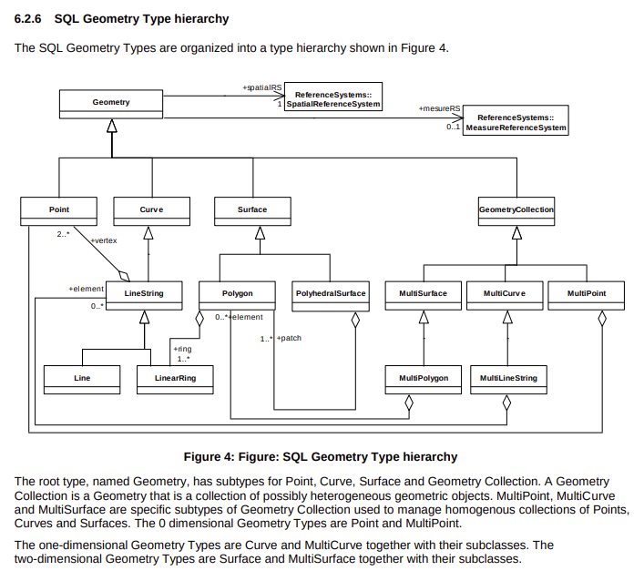

# Useful Resources

[Simple Features for R](https://cran.r-project.org/web/packages/sf/vignettes/sf1.html)

[What is an "XYZM" measurement model?](https://gis.stackexchange.com/questions/39131/what-is-an-xyzm-measurement-model)

[FileGDB Specification](https://github.com/rouault/dump_gdbtable/wiki/FGDB-Spec)

[Shapefile file extensions](https://resources.arcgis.com/en/help/main/10.2/index.html#/Shapefile_file_extensions/005600000003000000/)
